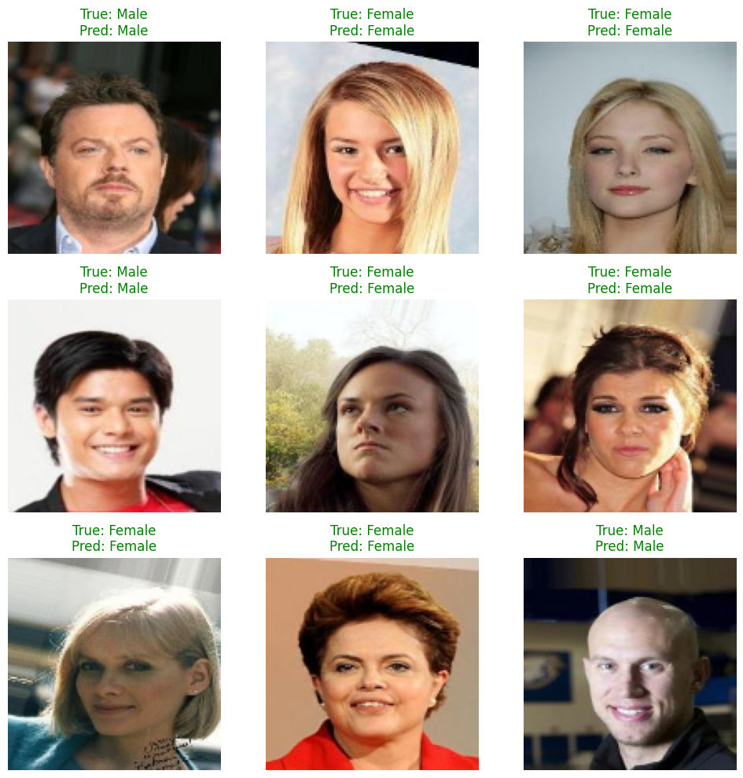

# Gender Classification CNN – CelebA

A binary gender classifier (Female / Male) built with a custom CNN in TensorFlow/Keras, trained on the [CelebA Gender Recognition 200K Images](https://www.kaggle.com/datasets/ashishjangra27/gender-recognition-200k-images-celeba) dataset.

[](https://www.kaggle.com/code/majdkhuzam/gender-classification-cnn-celeba)

---

## Project Structure

```
gender-classification-cnn-celeba/
├── src/
│   ├── data_loader.py   # Dataset loading & preprocessing
│   ├── train.py         # CNN architecture + training entry-point
│   ├── evaluate.py      # Evaluation & metrics
│   └── visualize.py     # Prediction visualisation (3×3 grid)
├── requirements.txt
└── .gitignore
```

---

## Model Architecture

| Layer | Details |
|---|---|
| Conv Block 1 | Conv2D(32) → BatchNorm → MaxPool |
| Conv Block 2 | Conv2D(64) → BatchNorm → MaxPool |
| Conv Block 3 | Conv2D(64) → BatchNorm → MaxPool |
| Dense Head | Dense(64, relu) → Dropout(0.2) → Dense(1, sigmoid) |

- **Input:** 128 × 128 × 3 (RGB)
- **Output:** Single sigmoid unit — probability of *Male* class
- **Loss:** Binary cross-entropy
- **Optimizer:** Adam

---

## Setup

```bash
pip install -r requirements.txt
```

---

## Dataset

Download from Kaggle:
[ashishjangra27/gender-recognition-200k-images-celeba](https://www.kaggle.com/datasets/ashishjangra27/gender-recognition-200k-images-celeba)

Expected directory layout:

```
Dataset/
├── Train/
│   ├── Female/
│   └── Male/
├── Test/
│   ├── Female/
│   └── Male/
└── Validation/
    ├── Female/
    └── Male/
```

---

## Usage

### 1. Train

```bash
python src/train.py
```

### 2. Evaluate

```bash
python src/evaluate.py
```

Prints test loss, accuracy, a full classification report, and a confusion matrix.

### 3. Visualise predictions

```bash
python src/visualize.py
```

Displays a 3×3 grid of random test images. Green title = correct prediction, red = incorrect.



---

## Evaluation Results

Evaluated on **20,001 test images** from the CelebA dataset.

| Metric | Value |
|---|---|
| Test Loss | 0.0783 |
| Test Accuracy | **98.04%** |

### Classification Report

| Class | Precision | Recall | F1-Score | Support |
|---|---|---|---|---|
| Female (0) | 0.98 | 0.98 | 0.98 | 11,542 |
| Male (1) | 0.98 | 0.97 | 0.98 | 8,459 |
| **Accuracy** | | | **0.98** | **20,001** |
| Macro avg | 0.98 | 0.98 | 0.98 | 20,001 |
| Weighted avg | 0.98 | 0.98 | 0.98 | 20,001 |

### Confusion Matrix

|  | Predicted Female | Predicted Male |
|---|---|---|
| **Actual Female** | 11,367 | 175 |
| **Actual Male** | 218 | 8,241 |

- **False Positives** (Female predicted as Male): 175
- **False Negatives** (Male predicted as Female): 218

---

## Requirements

| Package | Version |
|---|---|
| tensorflow | 2.19.0 |
| numpy | 2.0.2 |
| opencv-python | 4.13.0 |
| scikit-learn | 1.6.1 |
| matplotlib | 3.10.0 |
